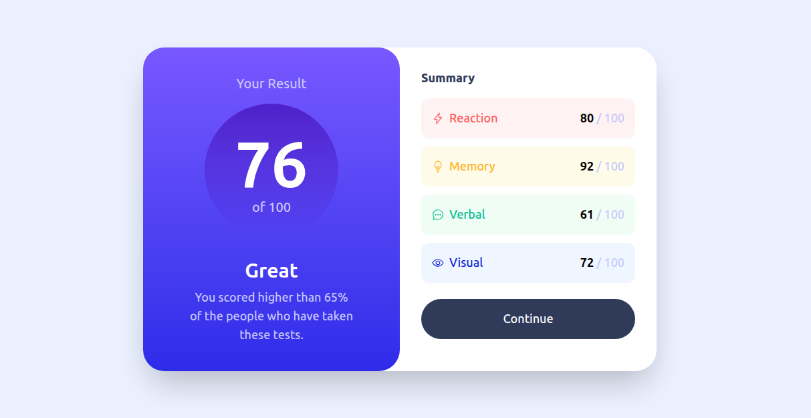

# Frontend Mentor - Results Summary Component Solution

This is a solution to the [Results summary component challenge on Frontend Mentor](https://www.frontendmentor.io/challenges/results-summary-component-CE_K6s0maV). The implementation uses semantic HTML5 and Tailwind CSS 4 to create a responsive results summary component that matches the design specifications.

## Table of contents

- [Overview](#overview)
  - [The challenge](#the-challenge)
  - [Screenshot](#screenshot)
  - [Links](#links)
- [My process](#my-process)
  - [Built with](#built-with)
  - [What I learned](#what-i-learned)
  - [Continued development](#continued-development)
  - [Useful resources](#useful-resources)
  - [Development process](#development-process)
  - [AI Collaboration](#ai-collaboration)
- [Author](#author)

## Overview

### The Challenge

Users should be able to:

- View the optimal layout for the interface depending on their device's screen size
- See hover and focus states for all interactive elements on the page

### Screenshot

### Links

- Solution URL: [Solution URL](https://github.com/KevenFonseca/results-summary-component)
- Live Site URL: [Live site URL](https://kevenfonseca.github.io/results-summary-component/)

## My process

### Built With

- Semantic HTML5 markup
- Tailwind CSS 4.3.0
- Flexbox and CSS Grid for layouts
- Mobile-first responsive design
- Ionicons for visual icons
- CSS custom properties (via Tailwind color values)

### What I Learned

In this challenge, I applied my learning with Tailwind CSS in a real project. This was my first project built from scratch using only HTML and Tailwind, transitioning from a CSS-only approach. I practiced:

- Effective use of Tailwind utility classes for styling
- Responsive design with mobile-first workflow using Tailwind breakpoints
- Flexbox and CSS Grid for layout management
- CSS linear gradients for creating gradient backgrounds
- Tailwind color customization with HSL values
- Semantic HTML structure for better accessibility
- Hover states for interactive elements
- Working with third-party icon libraries (Ionicons)

### Continued development

- Explore advanced Tailwind CSS features and plugins
- Deepen accessibility practices (ARIA labels, focus management)
- Optimize performance and improve CSS output size
- Add animations and transitions for better user experience
- Test across different browsers and devices

### Useful resources

- [Frontend Mentor](https://www.frontendmentor.io) - Challenge instructions and starter files
- [Tailwind CSS Documentation](https://tailwindcss.com/docs) - Official Tailwind CSS reference and guides
- [Tailwind CSS IntelliSense](https://marketplace.visualstudio.com/items?itemName=bradlc.vscode-tailwindcss) - VS Code extension for Tailwind autocomplete
- [Ionicons](https://ionicons.com/) - Icon library used in this project
- [MDN Web Docs](https://developer.mozilla.org/) - HTML, CSS, and web development referencld from zero just with HTML and Tailwind, the first use of tailwind was change the css approah to tailwind from a challenge that i build first with CSS only. I did a lot on the challenge using flexbox, grid, reponsive desing and i likeout i did it and how it end.

### Continued development

- Learn more about tailwind
- Go deep onthe responsive design
- Continue working on my semantic html and accessibility

### Development process

- Started with mobile design as the foundation
- Built semantic HTML structure first
- Styled with Tailwind CSS, focusing on responsive breakpoints
- Used browser DevTools to test responsiveness and debug styles
- Leveraged AI assistance for code review and debugging when encountering issues
- Iterated on design details to match the target design as closely as possible

### AI Collaboration

I used AI assistance to help understand and debug issues during development. When I encountered problems that were difficult to identify, VS Code's AI tools helped me identify the root cause and understand the solution. I also used AI for code review to identify areas for improvement and best practices.

## Author

- Frontend Mentor - [@KevenFonseca](https://www.frontendmentor.io/profile/KevenFonseca)
- LinkedIn - [@KevenFonseca](https://www.linkedin.com/in/keven-fonseca-b022072a5/)
- GitHub - [@KevenFonseca](https://github.com/KevenFonseca)